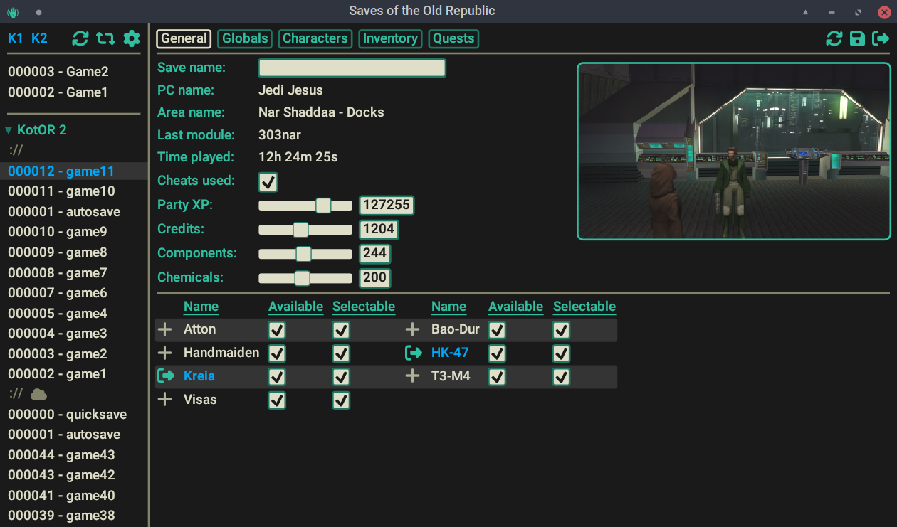

# Saves of the Old Republic


A new save editor for KotOR 1 and 2


# Warning

SotOR allows you to do things that would be impossible in the normal game and generally lacks sanity checks, potentially allowing you to break the save.

It stores a backup of the previous version of the save in .bak files in the save directory, but you may still want to back them up manually.

May or may not work with saves from non-English versions of the game. Use at your own risk.

# Differences from KSE

- Aims to provide the same and more features. Currently WIP.
- Runs natively on Windows, Linux and in the browser (experimental).
- Uses a built-in game database, allowing it to work wihout the game installed. Still capable of loading provided game files for your modding needs. Provided releases assume KotOR 1 Community patch and KotOR2 TSLRCM.
- Proper support for the updated steam version of TSL, including workshop.
- Does NOT support xbox and switch saves. See "Contributing" section.

# Contributing

If you encounter a bug or have a suggestion, please open an issue on github.

I would like to add support for the console versions, but I don't own any of them. If you're willing to provide save files and help with testing, please open an issue.

# Development

To build SotOR yourself you need to have the [rust toolchain](https://www.rust-lang.org/learn/get-started), platform-specific dependencies for [egui](https://github.com/emilk/egui/tree/3b19303e02bd2d386cf8b85b248388a25bfe9e26/crates/egui_glow) and [rfd](https://docs.rs/rfd/0.13.0/rfd/index.html#gtk-backend) and both games installed.

Set the `STEAM_APPS` environment variable to your steamapps directory or use a `.env` file. If you are not using steam it should still work if the provided directory has the correct structure. See `build.rs` for details.

Example:

```bash
echo STEAM_APPS=/mnt/storage/SteamLibrary/steamapps > .env
cargo run #run a debug build
cargo build --release #build a release version
```

To build for other targets you also need to install [cross](https://github.com/cross-rs/cross) and [trunk](https://trunkrs.dev/).

`build-all.sh` calls both and places output into `./target/build`

# Thanks

Thanks to [KSE](https://github.com/nadrino/kotor-savegame-editor), [NWN Wiki](https://nwn.wiki), [KotOR.js](https://github.com/KobaltBlu/KotOR.js) and [xoreos](https://github.com/xoreos/xoreos) projects for providing references on where and how to get the required game data.
